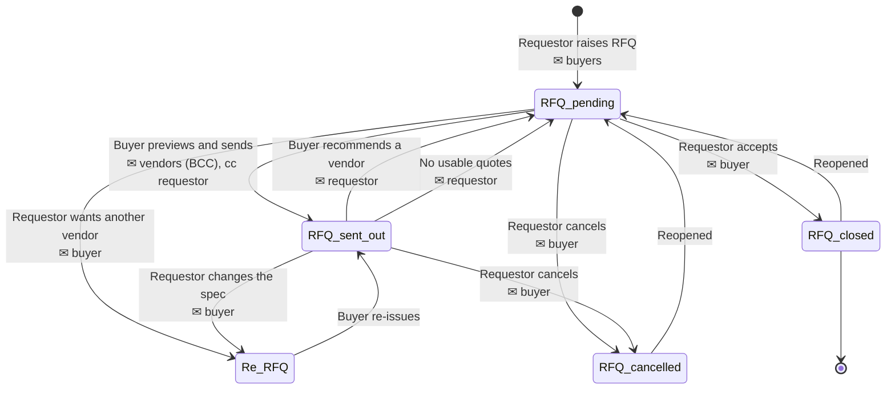

# PWCS RFQ Application

Power Apps canvas app that runs the Request For Quotation (RFQ) process for
Pratt & Whitney Component Solutions Pte Ltd (PWCS), Singapore.

A requestor raises an RFQ, a buyer sources it from up to four vendors, the
requestor accepts or rejects the buyer's recommendation, and the RFQ closes.
This repository holds the **screen source only** (`.yaml`, one file per screen).
The app manifest, `App.OnStart`, connections and the Power Automate flows live
in the Power Platform environment, not here — see
[What you need for this to work](#what-you-need-for-this-to-work).

---

## Table of contents

- [Architecture at a glance](#architecture-at-a-glance)
- [Screens](#screens)
- [Data sources](#data-sources)
- [The RFQ lifecycle](#the-rfq-lifecycle)
- [Email: who gets what, and when](#email-who-gets-what-and-when)
- [Power Automate flow contracts](#power-automate-flow-contracts)
- [What you need for this to work](#what-you-need-for-this-to-work)
- [SharePoint limits and archiving](#sharepoint-limits-and-archiving)
- [Known issues and follow-ups](#known-issues-and-follow-ups)
- [Validation and gating](#validation-and-gating)
- [Suggested vendors](#suggested-vendors)
- [Sorting](#sorting)
- [Conventions](#conventions)

---

## Architecture at a glance

There is no middle tier. The canvas app talks straight to SharePoint lists for
state, and calls Power Automate flows only to send mail (a canvas app cannot BCC
or send as a shared mailbox on its own).

```
                    ┌──────────────────────────────────┐
                    │      Canvas app (8 screens)      │
                    │  scrHome · scrNewRFQ · scrEditRFQ│
                    │  scrBuyerQueue · scrSendRFQ      │
                    │  scrChecklist · scrAwardConfirm  │
                    │  scrAdminUsers                   │
                    └───┬───────────────────────┬──────┘
        read / write    │                       │  .Run(...)
                        ▼                       ▼
      ┌─────────────────────────────┐   ┌───────────────────────────┐
      │  SharePoint Online lists    │   │     Power Automate        │
      │  ─────────────────────────  │   │  ───────────────────────  │
      │  RFQ            (state)     │   │  SendRFQToVendors         │
      │  RFQ_Checklist  (quotes)    │   │  SendRFQNotification      │
      │  PWS_SHQ ...SU  (roles)     │   └────────────┬──────────────┘
      │  SG Vendor Master List      │                │
      │  Currency Rate              │                ▼
      └─────────────────────────────┘        Office 365 Outlook
                                             (vendors, buyers,
                                              requestors)
```

**Two lists carry the workflow.** `RFQ` holds one item per request and owns the
status. `RFQ_Checklist` holds one item per RFQ and owns the four vendor slots
and their quotes. They are joined on `RFQ_Checklist.RFQID = RFQ.ID` — a plain
number column, not a lookup, so nothing cascades and either row can be repaired
independently.

**Two variables carry the selection.** Every screen reads `varSelectedRFQ` (the
`RFQ` row) and `varChecklist` (the `RFQ_Checklist` row). Screens re-fetch both in
`OnVisible` rather than trusting what the previous screen left behind, because
two people can work the same RFQ at once.

**Roles are data, not Entra groups.** `varRole` is resolved once in
`App.OnStart` from the `PWS_SHQ Purchase Requisition SU` list. Anyone not in
that list is a Requestor.

---

## Screens

| Screen | Who uses it | What it does |
|---|---|---|
| `scrHome` | Everyone | The requestor's own RFQs, an "awaiting you" panel, and role-gated links to the buyer queue and admin screen. Handles the `?rfq=` deep link. |
| `scrNewRFQ` | Requestor | Raises an RFQ. Creates the row via a form (needed so the Attachments control has somewhere to upload), then patches every other field in `OnSuccess`. **Emails the buyers.** |
| `scrEditRFQ` | Requestor | Views and edits an RFQ, cancels or reopens it, opens attachments and the activity log. A change to description / quantity / UOM on an already-sent RFQ forces a re-quote. **Emails the buyer on cancel and on re-quote.** |
| `scrBuyerQueue` | Buyer, Admin | Every RFQ in the system, sorted by due date. Routes to `scrSendRFQ` if no vendors are saved yet, otherwise to `scrChecklist`. Redirects non-buyers home. |
| `scrSendRFQ` | Buyer | Picks up to four vendors, saves them to the checklist, then previews and **sends the RFQ email to vendors**. |
| `scrChecklist` | Buyer | Records each vendor's quote, converts totals to USD, picks a recommendation. **Emails the requestor** on recommend and on "no usable quotes". |
| `scrAwardConfirm` | Requestor | Accepts the recommendation or asks for a different vendor. **Emails the buyer either way.** |
| `scrAdminUsers` | Admin | Grants and revokes Buyer/Admin access. Refuses to remove the last admin or to let an admin demote themselves. No email. |

---

## Data sources

### `RFQ` — one item per request

| Column | Type | Notes |
|---|---|---|
| `Title` | Text | RFQ number, generated as `RFQ 2026-0042` from the list ID. Unique by construction — the ID alone is unique, so the year is presentation only. RFQs raised before this format change keep their old `RFQ 202608 0006` titles. |
| `Description`, `Quantity`, `UOM` | Text / Number / Text | Changing any of these after the RFQ has gone out forces a re-quote. |
| `Urgency` | Choice | `Urgent`, `Not urgent`. Drives the default due date (+3 / +7 days). |
| `RFQ Raise Date`, `RFQduedate` | Date | |
| `Sole Source`, `Business Justification` | Yes/No, Text | Justification is required when the toggle is on. |
| `Requestor Email`, `RequestorName` | Text | Set from `User()` at raise time. **Every email path depends on `Requestor Email`.** |
| `Assigned Buyer` | Text | Set to the buyer's email when the RFQ email actually goes out. Blank until then. |
| `RFQ status` | Choice | `RFQ pending`, `RFQ sent out`, `Re-RFQ`, `RFQ closed/completed`, `RFQ cancelled`. |
| `AwaitingAction` | Choice | `Requestor`, `Buyer`, `Vendor`, `None`. Drives every "waiting on you" view. |
| `ReRFQCount` | Number | Incremented on each re-quote. |
| `Recommend Vendor`, `RecommendVendorEmail`, `RecommendVendorRemarks` | Text | Suggested vendor **1**. The first two are the original columns, kept so existing RFQs stay readable. |
| `RecVendor2Name`, `RecVendor2Email`, `RecVendor2Remarks` | Text | Suggested vendor **2**. |
| `RecVendor3Name`, `RecVendor3Email`, `RecVendor3Remarks` | Text | Suggested vendor **3**. |
| `Remarks` | Multiline text | Additional notes to the buyer. The hint text prompts for ECAR#, project schedule and catering details. |
| `ActivityLog` | Multiline text | Newest entry first, capped at 30,000 characters by `Left(...)`. |
| `Attachments` | Attachments | Requestor's drawings, specs, SOW. Sent with the vendor email by the flow. |

### `RFQ_Checklist` — one item per RFQ, joined on `RFQID`

`RFQID` (Number) plus, for each of vendors 1–4: `VendorNName`, `VendorNEmail`,
`VendorNCurrency` (Choice), `VendorNUnitPrice`, `VendorNTotalPrice`,
`VendorNLeadTime`, `VendorNStatus` (Choice: `Awaiting reply`, `Quoted`,
`No response`, …). Plus `RFQSentDate`, `AwardVendor` (Choice: `Vendor 1`–`Vendor
4`), `BuyerNotes`, `RequestorDecision` (Choice: `Confirmed`, `Alternate
requested`), `PreferredVendorName`, `RequestorJustification`.

### `PWS_SHQ Purchase Requisition SU` — access control

Exactly two columns, and **neither is required**:

| Column | Type | Notes |
|---|---|---|
| `User` | Person or Group | Absence from this list means Requestor. |
| `Role` | Single line of text | `Buyer` or `Admin`. Free text, not a choice column. |

This list is also the **recipient list for new-RFQ notifications**, so a buyer
who is not in it will not be told about new work.

Two consequences follow from that schema, and the app defends against both:

- **`Role` is free text, so its casing is not guaranteed.** The admin screen only
  ever writes `Buyer` or `Admin` from a fixed picker, but anyone editing the list
  in SharePoint can type `buyer`, `ADMIN` or `" Admin "`. Power Fx `=` on text is
  case-sensitive while SharePoint's server-side `eq` is not, so an exact match
  can behave differently depending on whether the query delegates. Every role
  comparison therefore goes through `Trim(Lower(...))`, and `App.OnStart`
  canonicalises `varRole` to exactly `Buyer` / `Admin` / `Requestor` so the
  screens can keep comparing it directly. Getting this wrong locks a real buyer
  out of their own queue, silently.
- **`User` can be blank.** A row with a role but no person would contribute an
  empty address, producing `a@x.com;;b@y.com` in a recipient string. The
  notification filters drop rows whose `User.Email` is blank.

Both filters use `Trim(Lower(...))`, which SharePoint cannot delegate. That is
deliberate and safe here — this list holds a handful of people, far below the
row limit. Do not "optimise" it back to a bare equality.

### `SG Vendor Master List` and `Currency Rate`

The vendor master is read into `colVendorList` as
`{ VendorName: field_2, VendorEmail: Coalesce(Emailcontact, "") }`. **One vendor
row may hold several addresses in `Emailcontact`, separated by semicolons**
(`john@x.com; pete@y.com`); the app keeps them as one string all the way to the
flow, which puts the lot on BCC. `Currency Rate` maps `Title` (currency code) to
`field_1` (rate to USD) and is used to compare quotes on a common basis.

---

## The RFQ lifecycle



`AwaitingAction` moves in lockstep with the status and is what the UI actually
filters on:

| Status | AwaitingAction | Sitting with |
|---|---|---|
| RFQ pending (just raised) | `Buyer` | Buyer queue |
| RFQ sent out | `Vendor` | Vendors |
| RFQ pending (recommendation made) | `Requestor` | Requestor's "awaiting you" panel |
| Re-RFQ | `Buyer` | Buyer queue |
| RFQ closed/completed | `None` | Nobody |
| RFQ cancelled | `None` | Nobody |

Nothing is ever locked. A closed or cancelled RFQ can be reopened from
`scrEditRFQ`, which puts it back to `RFQ pending` / `Buyer`.

---

## Email: who gets what, and when

Eight send points across seven transitions. Everything else in the app is a
`Notify()` toast, which only the person clicking ever sees.

| # | Trigger | Control | To | Cc | Flow |
|---|---|---|---|---|---|
| 1 | Requestor submits a new RFQ | `scrNewRFQ` › `frmNwAttach.OnSuccess` | All `Buyer` + `Admin` in the SU list | Requestor | `SendRFQNotification` |
| 2 | Buyer sends the RFQ to vendors | `scrSendRFQ` › `SendEmail` | Vendor emails on the checklist (**BCC**) | Requestor | `SendRFQToVendors` |
| 3 | Buyer recommends a vendor | `scrChecklist` › `btnCkSubmit` | Requestor | Buyer | `SendRFQNotification` |
| 4 | No usable quotes, re-sourcing | `scrChecklist` › `btnCkNoQuotes` | Requestor | Buyer | `SendRFQNotification` |
| 5 | Requestor accepts the award | `scrAwardConfirm` › `btnAwModalYes` | `Assigned Buyer`, else all buyers | Requestor | `SendRFQNotification` |
| 6 | Requestor asks for another vendor | `scrAwardConfirm` › `btnAwSubmitAlt` | `Assigned Buyer`, else all buyers | Requestor | `SendRFQNotification` |
| 7 | Requestor cancels the RFQ | `scrEditRFQ` › `btnEdModalYes` (`cancelrfq`) | `Assigned Buyer`, else all buyers | Requestor | `SendRFQNotification` |
| 8 | Requestor changes the spec after send | `scrEditRFQ` › `btnEdSave` | `Assigned Buyer`, else all buyers | Requestor | `SendRFQNotification` |

**Confidentiality rules baked into the vendor email (#2).** Vendors go on **BCC**
so they cannot see each other. The requestor is on **CC** so vendors can reach
them for technical questions. The body instructs vendors to send quotes only to
`pws.shq.quote@prattwhitney.com` and never to the requestor — this is what keeps
pricing away from the person who chooses the winner. Do not move vendors to
To/CC, and do not remove the buyer-only instruction, without a compliance review.

**Recipient resolution.**

- *Buyers* — `Coalesce('Assigned Buyer', <every Buyer/Admin in the SU list>)`.
  Once an RFQ has been sent out it has an owner, so replies go to that person;
  before that they go to the whole group.
- *Requestor* — `Coalesce('Requestor Email', 'Created By'.Email, "")`.
- Every send point checks its recipient string is non-blank first, and warns the
  user rather than firing a flow into the void.

### The vendor send path, in detail

This is the only email that leaves the company, so it is worth being explicit
about the order of operations:

```
btnSvSave            writes Vendor1-4 Name/Email to RFQ_Checklist
        │
        ▼
btnSvSend  ──or──  btnSvDraftEmail
        │                 │
        └────────┬────────┘
                 │  both re-read RFQ_Checklist for THIS RFQ
                 │  and rebuild colSvMailTo from it
                 ▼
          rtePreview   (buyer edits the HTML)
                 │
                 ▼
          SendEmail.OnSelect
                 │  re-reads the checklist and rebuilds colSvMailTo a third time
                 │  refuses to send if there are no vendor addresses
                 │  refuses to send if there is no requestor address
                 ▼
          SendRFQToVendors.Run(...)
                 │
                 ▼
          Patch RFQ → status "RFQ sent out", AwaitingAction "Vendor",
                      Assigned Buyer = the sender
```

The status is patched **after** the flow call, never before. If the buyer closes
the preview without sending, the RFQ stays in their queue.

---

## Power Automate flow contracts

Both flows take positional string arguments. The app passes them in this exact
order; changing the order in Power Automate silently changes who gets the mail.

### `SendRFQToVendors` (exists — 7 inputs)

| # | Argument | Example |
|---|---|---|
| 1 | Vendor emails, `;`-separated → **BCC** | `a@v1.com;b@v2.com` |
| 2 | Requestor email → **CC** | `jane.doe@prattwhitney.com` |
| 3 | Subject | `RFQ RFQ 202609 0042 . Reply by 12 Sep 2026` |
| 4 | HTML body (buyer-edited) | `<p>Dear vendors, …` |
| 5 | Buyer email → **From / Reply-To** | `buyer@prattwhitney.com` |
| 6 | RFQ list item ID → used to fetch attachments | `42` |
| 7 | RFQ number | `RFQ 202609 0042` |

The deployed flow maps these correctly: `text` → **Bcc**, `text_1` → **Cc**,
`text_4` → **To**, `text_2` → **Subject**, `text_3` → **Body**.

**It does not attach anything.** The flow initialises an `EmailAttachments`
array and calls *Get file properties*, then uses neither — while the send
preview tells the buyer "Any files the requestor attached go out with this email
automatically". Requestor drawings, specs and SOWs are silently not reaching
vendors. Two changes fix it:

1. *Get file properties* (`GetFileItem`) is the wrong operation — it reads
   document-library properties, not list-item attachments. Replace it with
   **Get attachments** (`GetAttachments`) against the same list and
   `id: @{triggerBody()?['number']}`.
2. Add an **Apply to each** over `@body('Get_attachments')` containing:
   - **Get attachment content** (`GetAttachmentContent`), same list,
     `id: @{triggerBody()?['number']}`, `fileId: @items('Apply_to_each')?['Id']`
   - **Append to array variable** → `EmailAttachments`:
     ```json
     {
       "Name": "@{items('Apply_to_each')?['DisplayName']}",
       "ContentBytes": "@body('Get_attachment_content')"
     }
     ```
   Then set the send action's **Attachments** to `@variables('EmailAttachments')`
   and point its `runAfter` at the Apply to each.

`text_5` (RFQNumber) is currently unused by the flow. That is harmless — the app
still passes it, and it is useful if you later want it in the attachment names
or in a logging step.

### `SendRFQNotification` (you still need to create this — 5 inputs)

> **Name check.** The 7-input flow above is the vendor flow. If it is currently
> named `sendRFQNotification` in Power Automate, rename it to
> **`SendRFQToVendors`** — that is the name `scrSendRFQ` calls — and build the
> 5-input flow below under the name `SendRFQNotification`. The two contracts are
> different lengths and different shapes (vendors on BCC vs. a person on To), so
> one flow cannot serve both.

A single internal-notification flow, used by all seven non-vendor emails.

| # | Argument | Type | Purpose |
|---|---|---|---|
| 1 | `to` | Text | One or more addresses, `;`-separated |
| 2 | `cc` | Text | One address, may be blank |
| 3 | `subject` | Text | Plain text |
| 4 | `body` | Text | HTML fragment |
| 5 | `rfqId` | Number | RFQ list item ID, for logging and for building links |

Minimum viable definition:

1. **Trigger** — *Power Apps (V2)*, with five inputs in the order above
   (`to`, `cc`, `subject` and `body` as Text; `rfqId` as Number).
2. **Action** — *Office 365 Outlook › Send an email (V2)*
   - **To** `@{triggerBody()['text']}`
   - **CC** `@{triggerBody()['text_1']}`
   - **Subject** `@{triggerBody()['text_2']}`
   - **Body** `@{triggerBody()['text_3']}` with *Is HTML* set to **Yes**
   - Leave **Attachments** empty. Internal notifications link to the item
     instead of copying files, which keeps Purview-labelled documents inside
     SharePoint.

Send it from a shared mailbox rather than the signed-in user if you want replies
to reach the whole buying team; otherwise the default (send as the signed-in
user) is correct and needs no extra configuration.

> These are internal emails only. They contain prices and vendor names, so the
> flow must not be given an external recipient parameter.

---

## What you need for this to work

### 1. `App.OnStart` — **not in this repository**

The screens depend on two globals that nothing here sets. Without them the app
loads with no role and no deep link. Set them in `App.OnStart`:

```powerfx
// This tenant signs users in with an employee-ID UPN (E40124966@adxuser.com),
// not a mailbox. Every address the app stores, sends to, or matches against the
// access list has to be the real mailbox, so resolve both once here.
Set(varMyUpn, Lower(User().Email));
Set(varMyMail, Lower(Coalesce(Office365Users.MyProfileV2().mail, User().Email)));

// Match on the mailbox, on the sign-in UPN, or on the login name inside the
// person column's Claims - whichever the row happens to carry.
Set(
    varRole,
    Switch(
        Trim(
            Lower(
                Coalesce(
                    LookUp(
                        'PWS_SHQ Purchase Requisition SU',
                        Lower(ThisRecord.User.Email) = varMyMail
                            || Lower(ThisRecord.User.Email) = varMyUpn
                            || varMyUpn in Lower(ThisRecord.User.Claims)
                    ).Role,
                    ""
                )
            )
        ),
        "admin", "Admin",
        "buyer", "Buyer",
        "Requestor"
    )
);

Set(varDeepLinkID, Value(Coalesce(Param("rfq"), "0")));
Set(varSaving, false);
Set(varConfirmAction, Blank());
Set(varShowAlternate, false);
```

### 2. Connections

Office 365 Users, SharePoint, and both Power Automate flows must be added to the
app. `Office365Users.MyProfileV2()` builds the buyer's signature block in the
vendor email; without that connection the signature renders blank.

### 3. SharePoint lists

The five lists above, on
`https://rtxusers.sharepoint.us/sites/PWS_SHQ-PW`. Give the app's users
**Contribute** on `RFQ` and `RFQ_Checklist`, and **Read** on
`SG Vendor Master List`, `Currency Rate` and the SU list. Admins need
Contribute on the SU list.

### 4. App settings

Raise **Settings › General › Data row limit for non-delegable queries** from
500 to **2000**. See the next section for why this matters.

### 5. Columns to add before deploying this version

The three-suggestion feature needs **seven new columns on the `RFQ` list**.
Suggested vendor 1 reuses the two columns that already exist, so no existing RFQ
data is lost and nothing needs migrating.

| Column | Type |
|---|---|
| `RecommendVendorRemarks` | Multiple lines of text — **Plain text** |
| `RecVendor2Name` | Single line of text |
| `RecVendor2Email` | Single line of text |
| `RecVendor2Remarks` | Multiple lines of text — **Plain text** |
| `RecVendor3Name` | Single line of text |
| `RecVendor3Email` | Single line of text |
| `RecVendor3Remarks` | Multiple lines of text — **Plain text** |

Set the multiline columns to **Plain text**, not Enhanced rich text. Enhanced
rich text returns HTML, which would appear as raw markup in the buyer's screen
and in the notification email.

After adding them, refresh the `RFQ` data source in the app (Data pane → `RFQ` →
Refresh) so the new columns resolve, otherwise every reference reads as an error.

### 6. Seed data

At least one `Admin` in the SU list (otherwise nobody can grant access, and
nobody is emailed when an RFQ is raised), and one row per currency in
`Currency Rate` — the quote comparison refuses to pick a winner if a rate is
missing, rather than comparing unlike currencies.

---

## SharePoint limits and archiving

**Yes — and there are two separate ceilings. The app hits the lower one first.**

### The 5,000 item list view threshold

SharePoint Online lists can hold up to 30 million items, but any single query
that has to *scan* more than **5,000** items is throttled and fails. Filtering or
sorting on a non-indexed column is what triggers it. Mitigations, in order:

1. **Index the columns the app filters and sorts on** — on `RFQ`: `Requestor
   Email`, `RFQ status`, `AwaitingAction`, `RFQduedate`, `Title`. On
   `RFQ_Checklist`: `RFQID`. A list may have up to 20 indexed columns. Do this
   *before* the list passes 5,000 items; indexing a list that is already over
   the threshold is much harder.
2. **Keep result sets under 5,000**, not just the list. An index lets you query
   a large list, but the rows coming back must still be fewer than 5,000.
3. **Archive** once the live list approaches the threshold.

### The limit this app actually hits first: 500 / 2,000

Power Apps caps how many rows a *non-delegable* query returns, at the
**Data row limit** setting — 500 by default, 2,000 maximum. Over that limit rows
are dropped **silently**, with no error.

| Query | Where | Delegable? | Behaviour at scale |
|---|---|---|---|
| `Filter(RFQ, 'Requestor Email' = User().Email)` | `scrHome` | ✅ Yes | Fine. Filtered server-side, and one person's RFQs stay well under the cap. |
| `ClearCollect(colBuyerRFQs, RFQ)` | `scrBuyerQueue` | ❌ No filter at all | **Breaks first.** Loads the whole list and truncates at the row limit. Once `RFQ` exceeds 500 items (2,000 after the settings change), RFQs vanish from the buyer queue with no warning. |
| `ForAll('SG Vendor Master List', …)` | `scrSendRFQ` | ❌ `ForAll` is not delegable | Vendors past the row limit cannot be found in the picker. |
| `Filter(SU list, Role = "Buyer" \|\| Role = "Admin")` | notifications | ✅ Yes | Fine — equality and `Or` are delegable, and the list is small. |

So the practical order of work is: raise the row limit to 2,000, add the
indexes, then archive to keep `RFQ` comfortably under 2,000 live items.

### Recommended archive design

Closed and cancelled RFQs are read-only history. Move them out.

1. **Create `RFQ_Archive` and `RFQ_Checklist_Archive`** with identical columns to
   the live lists, plus `ArchivedDate` (Date) and `OriginalID` (Number).
2. **Schedule a Power Automate flow**, monthly:
   - *Get items* from `RFQ` where
     `RFQ status` is `RFQ closed/completed` **or** `RFQ cancelled`
     **and** `Modified` is older than your retention window (12 months is a
     reasonable default — long enough to answer an audit from the app, short
     enough to keep the list small).
   - For each: create the item in `RFQ_Archive`, copy attachments, copy the
     matching `RFQ_Checklist` row to `RFQ_Checklist_Archive`, then delete both
     originals.
   - Use *Get items* with a **top count of 500** and let the flow page, so the
     archiver itself never trips the 5,000 threshold.
3. **Do not point the app at the archive.** Add a "View archived RFQs" button
   that calls `Launch()` on the archive list's SharePoint view. Archived RFQs are
   closed; nobody needs to edit them in the app, and keeping them out of the app
   is the entire point.
4. **Never archive an open RFQ.** Filter on status, not on age alone — a
   long-running RFQ that is still `Re-RFQ` must stay live.

The `ActivityLog` column already caps itself at 30,000 characters, so a
long-lived RFQ cannot grow without bound.

---

## Known issues and follow-ups

Ordered by impact. None of these are introduced by the email work; they are
pre-existing and are listed here so they are not lost.

### 1. Vendor attachments never reach vendors

`SendRFQToVendors` fetches nothing and attaches nothing, but the send preview
promises it does. See
[the flow contract](#sendrfqtovendors-exists--7-inputs) for the fix. Until it is
applied, buyers must attach requestor files to the outgoing mail by hand, or
vendors will quote against a description with no drawing.

### 2. `colBuyerRFQs` truncates silently

See [the limits section](#the-limit-this-app-actually-hits-first-500--2000).
Raising the row limit and archiving buys headroom; the durable fix is to filter
`scrBuyerQueue` server-side on `AwaitingAction` (equality on a choice column is
delegable) and re-query when the "Include closed and cancelled" toggle changes,
rather than loading the list and filtering in memory. That is a data-layer
change to the queue and should be tested against a copy of the list.

### 3. The requestor is never told the RFQ went out

Transition #2 CCs the requestor on the vendor email, so they do see it — but
they receive the full vendor-facing letter, including the "do not contact the
requestor" instructions written *about* them. A short separate note would read
better. Left as-is because changing it alters the CC behaviour that the
confidentiality rules depend on.

### 4. No reminder for overdue RFQs

`scrHome` and `scrBuyerQueue` both show an overdue count, but nothing emails
anyone. A scheduled flow over `RFQ` where `RFQduedate < today` and
`AwaitingAction` is not `None` would close the loop, and belongs in Power
Automate rather than in the app.

---

## Conventions

**Vendor addresses are a list, not a value.** `Emailcontact` may hold several
addresses separated by semicolons. The field is stored as typed (minus outer
whitespace) and passed through to the flow's BCC field intact — Outlook accepts
`a@x.com; b@y.com` as-is, so there is nothing to normalise. What guarantees the
field is usable is the validation regex, which accepts one address or a
semicolon-separated list and rejects empty entries, leading/trailing separators
and doubled separators. Selecting a different vendor **replaces** the address
rather than keeping the previous one — keeping it is how one vendor's RFQ
reaches another's inbox.

Two Power Fx constraints shape how that check is written, and both bite if you
edit it:

- **`IsMatch` needs a literal pattern.** Passing a variable fails to compile with
  *"Regular expression must be a constant value"*, so the pattern is written out
  in full at each of the six call sites. Change one, change all six.
- **`Split()` returns a `Value` column, not `Result`.** Referencing `Result`
  fails with *"Name isn't valid"*, and anything wrapping it then reports invalid
  arguments. The address count avoids `Split` altogether: it counts separators
  with `Len(x) - Len(Substitute(x, ";", "")) + 1`, which is exact because it only
  renders after the pattern has matched, and the pattern rejects a trailing `;`.

**Column naming.** Three columns were previously referenced under two spellings
each — `RFQduedate` / `'RFQ  due date'`, `ActivityLog` / `'ActivityLog '`, and
`ReRFQCount` / `'ReRFQCount '` (note the double and trailing spaces). These are
the SharePoint *internal* name and the *display* name of the same column; Power
Apps resolves both, which is why the app worked. All screens now use the
internal, space-free form. `Created By` is likewise used everywhere in place of
its internal name `Author`. **Keep to one spelling** — a mismatch here reads as
a blank field rather than as an error.

**Never trust a collection built by another control.** The wrong-vendor bug this
codebase used to have came from one button reading a collection that a different
button had populated for a different RFQ. Recipient lists are rebuilt from the
SharePoint row at the point of use, every time.

**Patch the record you just looked up.** Every write re-reads the row into
`varRFQRecord` first and checks it still exists, so an RFQ deleted by someone
else produces a clear message instead of a silent failure.

**Status changes after the side effect, never before.** An RFQ is only marked
`RFQ sent out` once the mail has actually left.

---

## Suggested vendors

A requestor can put forward up to **three** vendors, each with a name, an email
and a short remark saying why. The buyer sees all three on the vendor screen and
loads any of them into a sourcing slot with one click.

```
scrNewRFQ / scrEditRFQ                  scrSendRFQ                     scrChecklist
┌──────────────────────────────┐        ┌───────────────────────────┐  ┌──────────────────┐
│ Vendors you suggest (max 3)  │        │ Vendor 1..4 (buyer's list)│  │ Quotes 1..4      │
│  1 [master list ▾] │ email   │        │  ...                      │  ├──────────────────┤
│    why this vendor           │ ─────> ├───────────────────────────┤  │ What the         │
│  2 [master list ▾] │ email   │ writes │ Requestor suggested       │  │ requestor        │
│    why this vendor           │ to RFQ │  1 name email why [Use]   │  │ suggested        │
│  3 [Not listed ▸] name│email │ columns│  2 name email why [Use]   │  │  (read only)     │
│    why this vendor           │        │  3 name email why [Use]   │  │                  │
└──────────────────────────────┘        └───────────────────────────┘  └──────────────────┘
```

**The requestor picks from the same vendor master the buyer uses.** Each slot is a
searchable picker over `SG Vendor Master List`, and choosing a vendor fills the
email from `Emailcontact` — so a suggestion arrives with a working address rather
than one the buyer has to retype. A **Not on the list?** toggle per slot swaps the
picker for a free-text name box, for vendors that are not on the master yet. The
email box stays editable either way. On the Edit screen the toggle is pre-set from
the stored value: a saved vendor that is not on the master opens in manual mode.

**The buyer sees the suggestions twice**: on `scrSendRFQ` while choosing who to
approach, with a **Use this** button; and read-only on `scrChecklist` while
entering quotes, where the remarks explain why a vendor was put forward. The
checklist panel is deliberately read-only — the vendor list is changed in one
place only, under *Add or remove vendors*.

**"Use this" loads, it does not save.** It drops the name and email into the
first free vendor slot (1 → 4) as a manual entry, because a suggested vendor is
often not on the master list. The buyer still reviews it and presses **Save
vendor list**, so a suggestion can never reach a vendor without a buyer choosing
it. If all four slots are full the button says so rather than overwriting one.

**Rules the requestor is held to**, on both the New and Edit screens:

- a suggested vendor must have an email, or the buyer cannot contact them;
- an email with no vendor name is rejected rather than saved as an orphan;
- addresses are validated with the same pattern the buyer's vendor list uses, so
  `a@x.com; b@y.com` is accepted in one field;
- the same vendor cannot be suggested twice.

All three suggestions, with emails and remarks, are included in the new-RFQ
notification to the buyers, so they can size the job up from the email alone.

### Text box sizing

The long multi-line boxes were roughly halved so the denser screens fit the
768px canvas without scrolling: description 180 → 90 on New and 104 → 56 on Edit,
sole-source justification 160 → 80 and 64 → 44, buyer justification on the
checklist 120 → 62. They scroll, so nothing is lost — there is simply less dead
white space on a form where most entries are one or two lines.

## Sorting

Both list screens let the user choose the order. The filter runs once inside a
`With()`, and the chosen `Switch` branch sorts that result — so changing the sort
never re-runs the filter.

Where a sort has a natural tie-breaker, two nested `Sort()` calls are used. Power
Fx `Sort` is stable, so the inner ordering survives the outer pass: *Urgent
first, then due date* sorts by due date, then floats the urgent ones up, and
urgent RFQs stay in due-date order among themselves.

**Home** (`cboHmSort`, default *Waiting on me first*) — Waiting on me first ·
Due date soonest/latest · Recently updated · RFQ number newest/oldest · Status.

**Buyer Queue** (`cboBqSort`, default *Due date, soonest first*) — Due date
soonest/latest · Waiting on me first · Urgent first then due date · Overdue
first · Status · Requestor name · Recently updated · RFQ number newest first.

The two lists differ because the roles do: a requestor cares what is blocked on
them, a buyer cares what is about to breach a due date. Both defaults match what
the screen did before the pickers existed, so nobody's habits break.

To add an option, add a `{ Value: "..." }` row to the control's `Items` **and** a
matching branch to the `Switch` in the gallery's `Items`. The string must match
exactly; an unmatched value silently falls through to the default branch.

---

## Validation and gating

Nothing that writes data or moves the workflow on is reachable without its
preconditions being met. What each action refuses to do:

| Action | Refuses when |
|---|---|
| **Raise RFQ** `btnNwSubmit` | Description or quantity blank · quantity not a number > 0 · sole source with no justification · due date blank or in the past |
| **Save edits** `btnEdSave` | Greyed out on a closed or cancelled RFQ · description or quantity blank · quantity not a number > 0 · sole source with no justification · due date blank · due date moved into the past |
| **Save vendor list** `btnSvSave` | No vendor entered · any vendor missing a valid address · the same vendor listed twice |
| **Open send preview** `btnSvSend` | Greyed out until vendor 1 is saved · RFQ deleted meanwhile · no addresses stored |
| **Email vendors** `SendEmail` | Greyed out on an empty body · RFQ deleted meanwhile · no vendor addresses · no requestor address |
| **Recommend to requestor** `btnCkSubmit` | No vendor selected · no justification · recommended vendor has no total price · recommended vendor has no currency · RFQ deleted meanwhile |
| **Request re-quote** `btnAwSubmitAlt` | No justification |
| **Confirm award** `btnAwModalYes` | RFQ deleted meanwhile · no recommended vendor · recommended vendor has no price |
| **Grant access** `btnAuSave` | Invalid email · no name · no role · person already listed · demoting yourself · removing the last admin |

Two rules shape the ones that are easy to get wrong:

**Validate where the work is done, not where it fails.** A buyer could once
recommend a vendor with no price. The award screen refused it, so the requestor
got an email about a recommendation they could not act on and had to bounce it
back. The check belongs on the buyer's screen, and it names the vendor.

**Leaving a screen must not destroy work.** Three screens hold unsaved input:

- `scrEditRFQ` compares the form against the record and asks before discarding.
- `scrChecklist` writes the same draft "Save draft" writes, then navigates.
  Nothing is sent, so it does this without asking — which is what the screen's
  own footer already promises.
- `scrSendRFQ` asks. Auto-saving is wrong there: saving vendors re-runs
  validation and resets vendor status or clears quotes for removed vendors, so
  it must be deliberate.

Back buttons that carry no unsaved state, and navigation *into* a screen, are
deliberately not gated — a gate there only makes the app harder to use.
